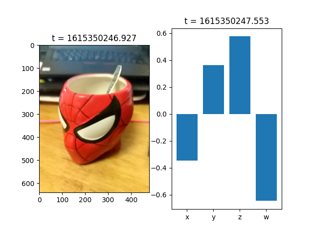
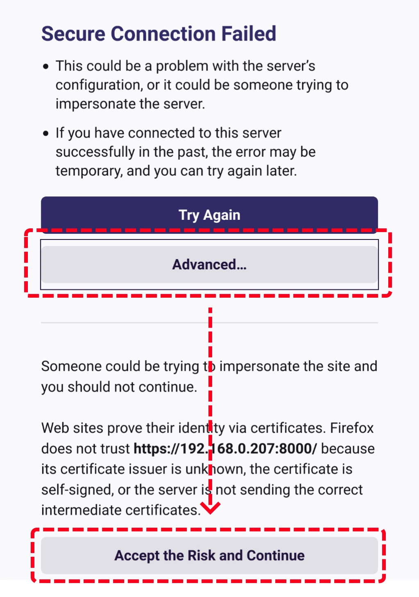

# machinevision-toolbox-python.phone-sensor

This package provides a `PhoneSensor` class which hosts a webapp through which you can easily retrieve camera and orientation data (if supported) from a smart-phone for example.

For best results, use with the latest possible version of Chrome on Android.

## Quick start

Install with `pip`:

```bash
pip install -U --force-reinstall machinevision-toolbox-python.phone-sensor
```

Example Code:

```python
from phone_sensor import PhoneSensor
from matplotlib import pyplot as plt
import numpy as np

# Hosts a webserver in a background thread.
# And display a QR code link to the app
with PhoneSensor(qrcode=True) as phone:
    # wait for button press to snap a photo
    bgr, time = phone.grab(button=True)
    # get device orientation as a Quaternion
    imu_data = phone.imu()

    plt.subplot(1, 2, 1)
    # img is bgr (opencv style), matplotlib uses RGB - so flip
    rgb = np.flip(bgr, axis=2)
    plt.imshow(rgb)
    plt.title(f"t = {time}")

    plt.subplot(1, 2, 2)
    plt.bar(['x', 'y', 'z', 'w'], imu_data.quaternion)
    plt.title(f"t = {imu_data.unix_timestamp}")
    plt.show()
```

which will output:



<table>
<tr>
<td>
The above code will create an ASCII QRcode in your terminal. Scanning it with a smartphone will take you to a webapp hosted by the `PhoneSensor`. Due to browser API security concerns, the app must be served over HTTPS, which in this case requires a self-signed certificate. Therefore you must accept the certificate before accessing the app (don't be scared!). For example, on Firefox Android:
</td>
<td>

</td>
</tr>
</table>

Once done, you should be met with the main UI, which looks like:


The output `img` is a `width x height x 3` BGR `np.ndarray` like you'd expect from `machinevisiontoolbox` or `opencv-python`.

## Documentation

### PhoneSensor()

```python
class phone_sensor.PhoneSensor(): ...

def PhoneSensor.__init__(self, *, qrcode=False, host='0.0.0.0', port=8000,
                         logger=logging.getLogger('mvt.phone_sensor'), log_level=logging.WARN,
                         proxy_client_from=None)
```

- **Parameters**

  - **qrcode** (`bool`) – True to output a QRCode in the terminal window that points to the server accessible via LAN, defaults to False

  - **host** (`str`) – Which hostname/ip to host the server on, defaults to “0.0.0.0”

  - **port** (`int`) – Which port to host the server on, defaults to 8000

  - **logger** (`Logger`) – A standard logging.Logger for debugging and general log information, defaults to logging.getLogger(‘mvt.phone_sensor’)

  - **log_level** (`int`) – Log level for the aforementioned logger, defaults to logging.WARN

  - **proxy_client_from** (`Optional`[`str`]) – A separate host from which to proxy the web client, defaults to None.
    Mainly for development purposes, using a hot-reloaded webpack server for the client
    rather than the one shipped with your pip install

---

### PhoneSensor.close()

```python
def PhoneSensor.close(self)
```

Close the server and relinquish control of the port.
Use of PhoneSensor as a context manager is preferred to this where suitable.
May be called automatically by the garbage collector.

---

### PhoneSensor.grab()

```python
def PhoneSensor.grab(self, cam='back', *, resolution=(640, 480), button=False, wait=None,
                     encoding='webp', quality=90) -> Tuple[np.ndarray, float]
```

Grab an image from the first/currently connected webapp client

- **Parameters**

  - **cam** (`Literal`[‘front’, ‘back’]) – Default camera to use, defaults to ‘back’.
    Most smartphones have a ‘front’ (the side with the touchscreen) and a ‘back’ camera.
    This may be temporarily overridden through the menu on the client.

  - **resolution** (`Tuple`[`int`, `int`]) – The desired resolution (width, height) of the photo, defaults to (640, 480).
    Choosing lower values will increase performance, allowing you to take more photos in quicker succession.
    Note this is not necessarily respected - It’s up to the browser’s implementation which resolution
    it chooses, with this value being the ‘ideal’. For example, if you ask for (999999, 480)
    the browser might choose (640, 480) instead.

  - **button** (`bool`) – True to wait for button press, defaults to False.

  - **wait** (`Optional`[`float`]) – Minimum amount of time to wait since previous photo before taking a new one, defaults to None.
    Incompatible with the button arg.

  - **encoding** (`Literal`[‘jpeg’, ‘png’, ‘webp’, ‘bmp’]) – The encoding mimetype for the image, defaults to ‘webp’.
    In order of most to least performance, the recommended options are: [‘webp’, ‘jpeg’, ‘png’, ‘bmp’].
    ‘webp’ and ‘jpeg’ are lossy compressions, so they will have differing compression artifacts.
    ‘png’ and ‘bmp’ are lossless. ‘bmp’ is essentially “no encoding” so you may use this if
    network is not a bottleneck (which it typically is). Otherwise ‘png’ is also lossless.

  - **quality** (`int`) – The quality (within (0, 100]) at which to encode the image, defaults to 90.
    Lower may slightly increase performance at the cost of image quality, however,
    the effect is typically insignificant. Does nothing for lossless encodings such as ‘png’.

- **Raises**

  **PhoneSensor.ClientDisconnect** – If the device disconnects from the app after receiving the command.

- **Return type**

  `Tuple`[`ndarray`, `float`]

- **Returns**

  An (img, timestamp) tuple,
  where img is a numpy.ndarray in the format you would expect from OpenCV (h x w x bgr)
  and timestamp is a unix timestamp from the client device (seconds since epoch)

---

### PhoneSensor.imu()

```python
def PhoneSensor.imu(self, wait=None) -> ImuDataFrame
```

Retrieve orientation and motion data from a capable device.

- **Parameters**

  **wait** (`Optional`[`float`]) – Minimum amount of time to wait since previous reading before taking a new one, defaults to None.

- **Raises**

  - **PhoneSensor.ClientDisconnect** – If the device disconnects from the app after receiving the command.

  - **PhoneSensor.DataUnavailable** – if the device is incapable of providing the data (eg. desktop pc),
    or if the browser disallows it, either due to app permissions or if it does not support the features.

- **Return type**

  `PhoneSensor.ImuDataFrame`

- **Returns**

  An ImuDataFrame, with the orientation and IMU sensor data.

---

### PhoneSensor.ImuDataFrame

```python
class PhoneSensor.ImuDataFrame:
    unix_timestamp: float
    quaternion: Tuple[float, float, float, float] # (x, y, z, w)
    # if supported by the browser (rare)
    accelerometer: Optional[Tuple[float, float, float, float]] # (x, y, z)
    gyroscope: Optional[Tuple[float, float, float, float]] # (x, y, z)
    magnetometer: Optional[Tuple[float, float, float, float]] # (x, y, z)

```

A collection of sensor readings taken from the phone and the time at which it was recorded. Includes raw accelerometer, magnetometer and gyroscope tuples if supported by the browser (generally only new versions of Android Chrome).

## Contributing

PRs welcome! The stack is Python3.6 and Typescript4.1 & CreateReactApp4.0

### Development Install

First, clone this repo and install dependencies

```bash
npm install
pip install -e .
```

### Running in Development Mode

1. Run the dev-server (and keep it running):

```bash
npm start
```

2. Create a PhoneSensor in proxy mode:

```python
>>> from phone_sensor import PhoneSensor
>>> phone = PhoneSensor(qrcode=True, proxy_client_from="localhost:3000")
>>> phone.grab(button=True)
```

or just run the `python examples/devmode.py`

Then click the link in terminal to test the app
