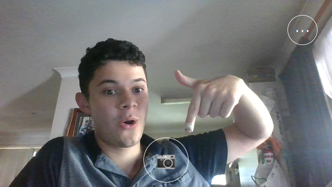

# machinevision-toolbox-python.phone-sensor

## Quickstart

Install with `pip`:

```bash
pip install -U machinevision-toolbox-python.phone-sensor
# or
pip install git+https://github.com/CallumJHays/machinevision-toolbox-python.phone-sensor
```

Example Code:

```python
from phone_sensor import PhoneSensor
from matplotlib import pyplot as plt

# Hosts a webserver in a background thread.
# Display a QR code link to the app
phone = PhoneSensor(qrcode=True)

# wait for button press to snap a photo
img = phone.grab(button=True)
# get device orientation as a Quaternion
quaternion = phone.imu().quaternion

plt.subplot(1, 2, 1)
plt.imshow(img)
plt.subplot(1, 2, 2)
plt.bar(['x', 'y', 'z', 'w'], quaternion)
plt.show()
```

The above code will create an ASCII QRcode in your terminal. Scanning it with a smartphone will take you to a webapp hosted by the `PhoneSensor`, which looks like:



The output `img` is a `width x height x 3` rgb `np.ndarray` like you'd expect from `machinevisiontoolbox` or `opencv-python`.

## Contributing

PRs welcome! The stack is Python3.6 and Typescript4.1 & CreateReactApp4.0

### Development Install

First, clone this repo and install dependencies

```bash
npm install
pip install -e .
```

### Running in Development Mode

1. Run the dev-server (and keep it running):

```bash
npm start
```

2. Create a PhoneSensor in proxy mode:

```python
>>> from phone_sensor import PhoneSensor
>>> phone = PhoneSensor(qrcode=True, \
        proxy_client_from="localhost:3000")
>>> phone.grab(button=True)
```

or just run the `python examples/devmode.py`

Then click the link in terminal to test the app
